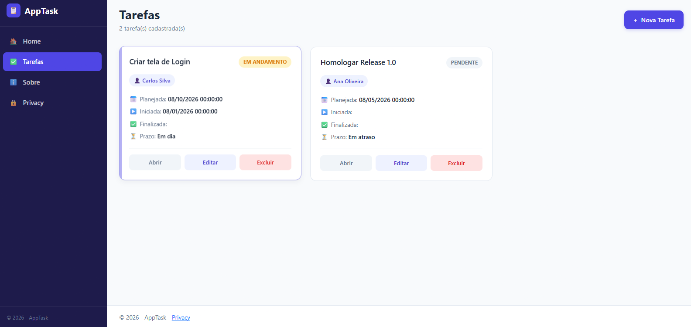

# LabUseCase04 - ASP.NET evoluíndo FRONT END com IA (UX/UI)
Seja bem-vindo ao **LabUseCase04**! Neste laboratório prático, você evoluir o seu front end de todo o sistema para deixá-lo com uma "cara" profissional.

Para facilitar, você deve usar uma IA Generativa (ChatGPT, Gemini, Cloud Code ou outra). 

Uma vez que a IA vai faciltiar a sua vida, logo você tem o dever que todas as telas seguiam um padrão visual profissional e seja de fácil USO. Faça um estudo, pesquisa sobre conceitos de UX/UI e aplicar esse conhecimento para tornar seu projeto o mais profissional.

Você pode fazer evolução do front end a partir dessa branch, ou pode usar sua branch develop. 
Importante criar uma nova branch e depois de pronto fazer merge com sua branch develop.

---

# 📋 Exemplo de Tela criada com IA

  

### Teste e coloque em Produçao

Depois de tudo pronto faça o merge com sua branch develop ou outra.

Pronto!